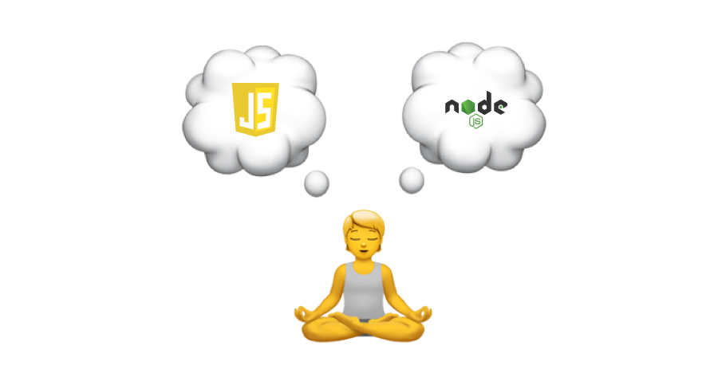
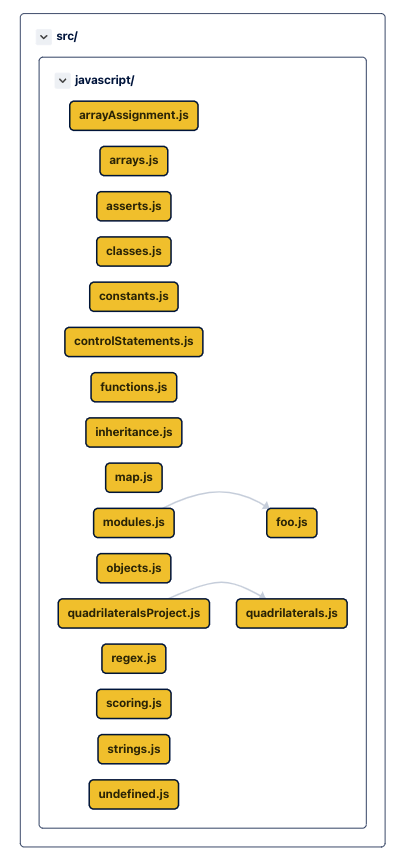
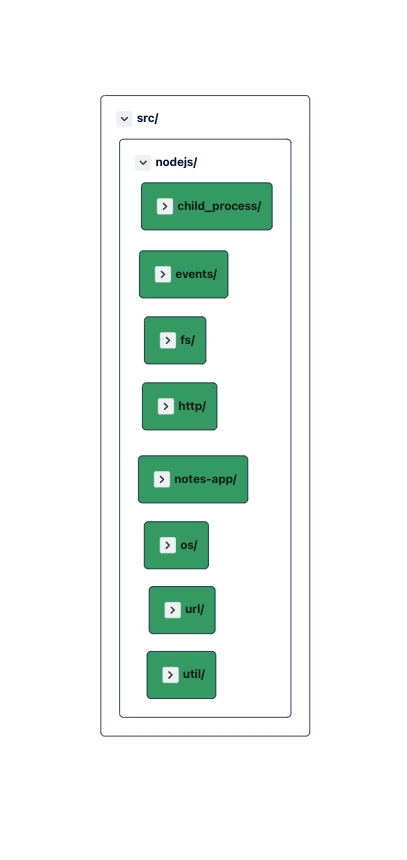

    

# Node.js Koans

The Nodejs Koans walk you along the path to enlightenment in order to learn JavaScript + Nodejs. The goal is to learn the JavaScript language & Nodejs, syntax, structure, and some common functions and libraries.

## The Structure 🗃️

The koans is broken into different files, strings are covered in `strings.js`. Similarly, arrays are touched in `arrays.js`. These files are then imported in `test/index.test.js`.

Each koan builds up your knowledge of JavaScript and builds upon itself. It will stop at the first place you need to correct.

Some koans simply need to have the correct answer substituted for an incorrect one. Some, however, require you to supply your own answer. If you see the method `__` (a double underscore) listed, it is a hint to you to supply your own code in order to make it work correctly.

Refer diagramatic representation [here](https://app.codesee.io/maps/public/e3271660-2d86-11ec-8c85-f958d9504daa)

## Installation Steps 🔨

- To install project execute : \
`npm install`

- Execute koans : \
`npm run test --silent`

## What it covers?

JavaScript                 |  Node.js
:-------------------------:|:-------------------------:
  |  

### [Inspiration Video](https://www.youtube.com/watch?v=LrhkUsRg3vo&ab_channel=OmniakaEverything) 💡